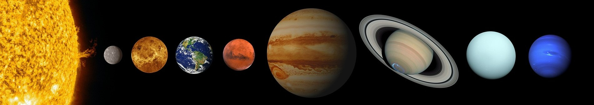
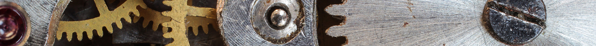
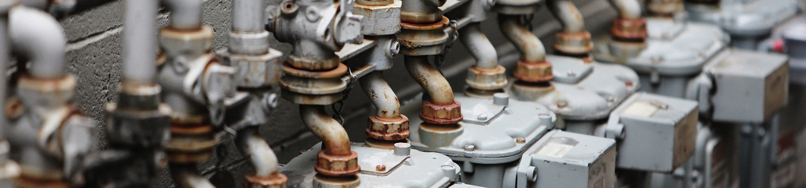

<div align="center">
    <a align="center" href="https://marketplace.visualstudio.com/items?itemName=decameron.solar-system-theme"></a>
</div>
<br/>

<div align="center">

# Solar System Theme
📌 This is Work In Progress! We would love to hear your [feedback](https://github.com/decameronn/solar-system-theme/issues)! 📌  
📌 **NEWS:** All Planets are Released!__. 📌  

[](https://opensource.org/licenses/MIT)


  
</div>
<br/>

<div>

<table width='100%' align="left">
    <tr>
        <td align="center">
            <strong><code>✨ The marvelous Solar System imagined for VS Code - Choose your planet! ✨</code></strong>
        </td>
    </tr>
    <tr>
        <td>
            A professional, hand-crafted theme for Visual Studio Code. Every planet of the Solar System has the color hand-picked, based on high quality, real life images, to reflect the color palette as accurately as possible. Great attention is paid to every detail for the most authentic experience.<br/> 
            Whenever the case, tiny artistic brushes are applied for a more pleasant experience and better readability.<br/>
            We hope you'll enjoy it (as much as we do!). </a>
        </td>
    </tr>
    <tr>
        <td>
            This project is being developed and maintained by <a href='https://github.com/decameronn' target="_blank">Decameron</a>.
        </td>
    </tr>
</table>
</div>

<br/>
<br/>

<div align="center">
    <a align="center" href="https://github.com/decameronn/solar-system-theme"></a>
</div>

<div align="center">

## Quick & Alternate Install

</div>

### Quick Install
1. Open the extensions sidebar on VS Code  
2. Search for **Solar System Theme**  
3. Click **Install** to install it  
4. Select **Set Color Theme**  
5. Code/File ＞ Preferences ＞ Color Theme ＞ **Solar System** > Select the desired theme  
6. Please [rate it](https://marketplace.visualstudio.com/items?itemName=decameron.solar-system-theme) if you enjoy it!  

### Alternate Install
1. Launch Quick Open menu using  <kbd>Cmd</kbd>+<kbd>P</kbd> or <kbd>Ctrl</kbd>+<kbd>P</kbd>  
2. Type the command `ext install solar-system-theme`
3. Click **Install** to install it  
4. Click on **Reload** to reload VS Code  
5. Code/File ＞ Preferences ＞ Color Theme ＞ **Solar System** > Select the desired theme  
6. Please [rate it](https://marketplace.visualstudio.com/items?itemName=decameron.solar-system-theme) if you enjoy it!  

<br/>
<div align="center">
    <a align="center" href="https://github.com/decameronn/solar-system-theme"></a>
</div>

<div align="center">

## Recommended custom settings

</div>
<br/>

We recommend the following settings for the best experience, especially if you have [Cascadia Code](https://github.com/microsoft/cascadia-code) font installed.  
  
<br/>

```json
"workbench.iconTheme": "vscode-icons",
"workbench.productIconTheme": "fluent-icons",
"editor.fontFamily": "'Cascadia Code Light', 'Jetbrains Mono', 'Fira Code', monospace",
"terminal.integrated.fontFamily": "'Cascadia Code Light', 'Jetbrains Mono', monospace",
"editor.fontSize": 16,
"editor.fontLigatures": true,
"terminal.integrated.fontSize": 14,
"terminal.integrated.cursorStyle": "line",
"files.autoSave": "afterDelay"
```

<br/>
<div align="center">
    <a align="center" href="https://github.com/decameronn/solar-system-theme"></a>
</div>

<div align="center">

## Release schedule

</div>

We aim to release one sub-theme, once every two-weeks.  
Please note: The theme collection will be updated and you will have to reload VS Code before chosing the newest theme.

<div>

<table width='65%' align='center'>
    <th colspan=4>Release Status</th>
    <tr colspan=4>
        <td>Mercury</td><td>Released</td>
        <td>Venus</td><td>Released</td>
    </tr>
    <tr colspan=4>
        <td>Earth</td><td>Released</td>
        <td>Mars</td><td>Released</td>
    </tr>
    <tr colspan=4>
        <td>Jupiter</td><td>Released</td>
        <td>Saturn</td><td>Released</td>
    </tr>
    <tr colspan=4>
        <td>Uranus</td><td>Released</td>
        <td>Neptune</td><td>Released</td>
    </tr>
</table>  

</div>
<br/>

<div>

You can read more about the planetary system we all live in on [Wikipedia](https://en.wikipedia.org/wiki/Solar_System)  

</div>

<br/>

<div align="center">
    <a align="center" href="https://github.com/decameronn/solar-system-theme"></a>
</div>

<div align="center">

## Look & Feel

</div>

### Mercury

### Venus

### Earth

### Mars

### Jupiter 

### Saturn 

### Uranus 

### Neptune 

